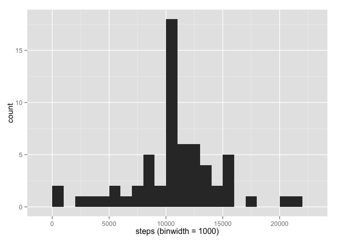

# Reproducible Research: Peer Assessment 1

## Loading and preprocessing the data

### 1. Load the data (i.e. read.csv())


```r
library(knitr)
opts_chunk$set(fig.path="figure/")
library(dplyr)
```

```
## 
## Attaching package: 'dplyr'
## 
## The following objects are masked from 'package:stats':
## 
##     filter, lag
## 
## The following objects are masked from 'package:base':
## 
##     intersect, setdiff, setequal, union
```

```r
library(lubridate)
library(ggplot2)
library(lattice)
if (! file.exists("activity.csv")) {
  unzip("activity.zip")
}
data = read.csv(file = "activity.csv", header = TRUE, stringsAsFactors = FALSE)
```

### 2. Process/transform the data (if necessary) into a format suitable for your analysis


```r
d = tbl_df(data)
d
```

```
## Source: local data frame [17,568 x 3]
## 
##    steps       date interval
## 1     NA 2012-10-01        0
## 2     NA 2012-10-01        5
## 3     NA 2012-10-01       10
## 4     NA 2012-10-01       15
## 5     NA 2012-10-01       20
## 6     NA 2012-10-01       25
## 7     NA 2012-10-01       30
## 8     NA 2012-10-01       35
## 9     NA 2012-10-01       40
## 10    NA 2012-10-01       45
## ..   ...        ...      ...
```

## What is mean total number of steps taken per day?

### 1. Make a histogram of the total number of steps taken each day


```r
total <- d %>%
  group_by(date) %>%
  summarise(sum_steps = sum(steps))
# total <- mutate(total, m = as.numeric(substr(date, 6, 7)), d = as.numeric(substr(date, 9, 10)))
ggplot(total, aes(sum_steps)) +
  geom_histogram(binwidth = 1000) +
  xlab("steps (binwidth = 1000)")
```

 

### 2. Calculate and report the mean and median total number of steps taken per day

The mean quantity and median quantity are the follwoings:


```r
mean_total <- mean(total$sum_steps, na.rm = TRUE)
mean_total
```

```
## [1] 10766.19
```

```r
median_total <- median(total$sum_steps, na.rm = TRUE)
median_total
```

```
## [1] 10765
```

## What is the average daily activity pattern?

### 1. Make a time series plot (i.e. type = "l") of the 5-minute interval (x-axis) and the average number of steps taken, averaged across all days (y-axis)


```r
interval <- d %>%
  group_by(interval) %>%
  summarise(mean_steps = mean(steps, na.rm = TRUE))
ggplot(interval, aes(interval, mean_steps)) + geom_line()
```

 

### 2. Which 5-minute interval, on average across all the days in the dataset, contains the maximum number of steps?


```r
filter(interval, mean_steps == max(interval$mean_steps))
```

```
## Source: local data frame [1 x 2]
## 
##   interval mean_steps
## 1      835   206.1698
```

Such that the 5-minute interval is `835` .

## Imputing missing values

### 1. Calculate and report the total number of missing values in the dataset (i.e. the total number of rows with NAs)


```r
str(d)
```

```
## Classes 'tbl_df', 'tbl' and 'data.frame':	17568 obs. of  3 variables:
##  $ steps   : int  NA NA NA NA NA NA NA NA NA NA ...
##  $ date    : chr  "2012-10-01" "2012-10-01" "2012-10-01" "2012-10-01" ...
##  $ interval: int  0 5 10 15 20 25 30 35 40 45 ...
```

```r
d %>% filter(is.na(steps)) %>% count()
```

```
## Source: local data frame [1 x 1]
## 
##      n
## 1 2304
```

### 2. Devise a strategy for filling in all of the missing values in the dataset. The strategy does not need to be sophisticated. For example, you could use the mean/median for that day, or the mean for that 5-minute interval, etc.

**I will use average 5-minute intervals to fill NA values in the data.**

To fill NAs, I calculated the average steps per interval, and then, join them with the original dataset by interval, and finally, if there is any NA in the orignal data, each NA was replaced by the average value.

### 3. Create a new dataset that is equal to the original dataset but with the missing data filled in.


```r
avg_steps <- d %>%
  group_by(interval) %>%
  summarise(avg_steps = mean(steps, na.rm = TRUE))

filled <- d %>%
  left_join(avg_steps) %>%
  mutate(new_steps = ifelse(is.na(steps), avg_steps, steps))
```

```
## Joining by: "interval"
```

```r
filled
```

```
## Source: local data frame [17,568 x 5]
## 
##    steps       date interval avg_steps new_steps
## 1     NA 2012-10-01        0 1.7169811 1.7169811
## 2     NA 2012-10-01        5 0.3396226 0.3396226
## 3     NA 2012-10-01       10 0.1320755 0.1320755
## 4     NA 2012-10-01       15 0.1509434 0.1509434
## 5     NA 2012-10-01       20 0.0754717 0.0754717
## 6     NA 2012-10-01       25 2.0943396 2.0943396
## 7     NA 2012-10-01       30 0.5283019 0.5283019
## 8     NA 2012-10-01       35 0.8679245 0.8679245
## 9     NA 2012-10-01       40 0.0000000 0.0000000
## 10    NA 2012-10-01       45 1.4716981 1.4716981
## ..   ...        ...      ...       ...       ...
```

```r
filled %>% filter(is.na(new_steps)) %>% count()
```

```
## Source: local data frame [1 x 1]
## 
##   n
## 1 0
```

### 4. Make a histogram of the total number of steps taken each day and Calculate and report the mean and median total number of steps taken per day. Do these values differ from the estimates from the first part of the assignment? What is the impact of imputing missing data on the estimates of the total daily number of steps?


```r
total2 <- filled %>%
  group_by(date) %>%
  summarise(sum_steps = sum(new_steps))

# after filling
ggplot(total2, aes(sum_steps)) +
  geom_histogram(binwidth = 1000) +
  xlab("steps (binwidth = 1000)")
```

 

```r
mean_total2 <- mean(total2$sum_steps, na.rm = TRUE)
mean_total2
```

```
## [1] 10766.19
```

```r
median_total2 <- median(total2$sum_steps, na.rm = TRUE)
median_total2
```

```
## [1] 10766.19
```

```r
# differences
diff_mean = mean_total2 - mean_total
diff_mean
```

```
## [1] 0
```

```r
diff_median = median_total2 - median_total
diff_median
```

```
## [1] 1.188679
```

## Are there differences in activity patterns between weekdays and weekends?

### 1. Create a new factor variable in the dataset with two levels -- "weekday" and "weekend" indicating whether a given date is a weekday or weekend day.


```r
d3 <- mutate(filled, kind = factor(ifelse(wday(date) %in% c(1, 7), "weekend", "weekday")))  # 1 and 7 means sunday and saturday respectively.
str(d3)
```

```
## Classes 'tbl_df', 'tbl' and 'data.frame':	17568 obs. of  6 variables:
##  $ steps    : int  NA NA NA NA NA NA NA NA NA NA ...
##  $ date     : chr  "2012-10-01" "2012-10-01" "2012-10-01" "2012-10-01" ...
##  $ interval : int  0 5 10 15 20 25 30 35 40 45 ...
##  $ avg_steps: num  1.717 0.3396 0.1321 0.1509 0.0755 ...
##  $ new_steps: num  1.717 0.3396 0.1321 0.1509 0.0755 ...
##  $ kind     : Factor w/ 2 levels "weekday","weekend": 1 1 1 1 1 1 1 1 1 1 ...
```

### 2. Make a panel plot containing a time series plot (i.e. type = "l") of the 5-minute interval (x-axis) and the average number of steps taken, averaged across all weekday days or weekend days (y-axis).


```r
interval2 <- d3 %>%
  group_by(interval, kind) %>%
  summarise(mean_steps = mean(steps, na.rm = TRUE))

xyplot(interval2$mean_steps ~ interval2$interval | interval2$kind, 
       type = "l",
       layout = c(1, 2),  
       xlab = "Interval", ylab = "Number of steps")
```

 
